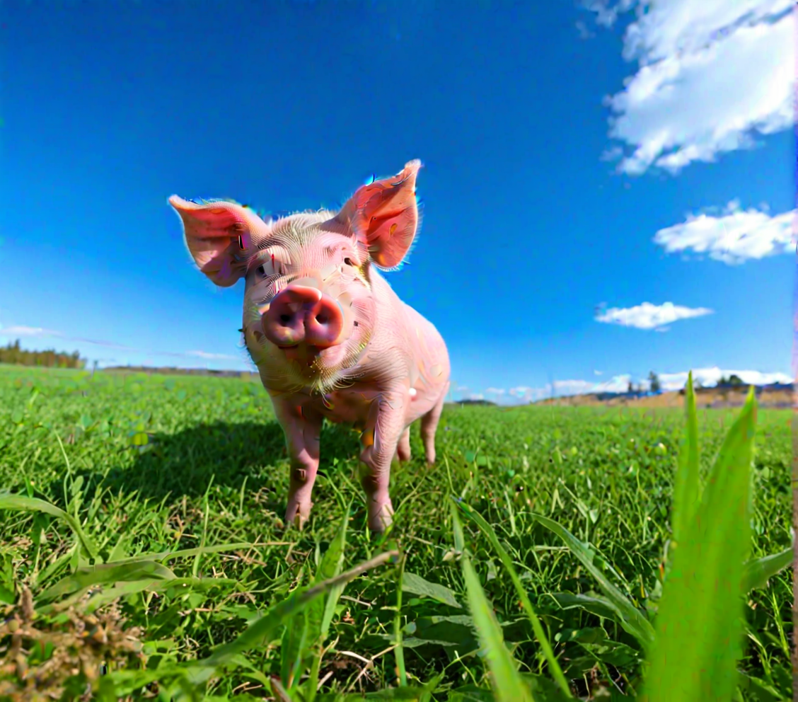

# ComfyUI

# Getting started
Downloaded ComfyUI from [ComfyUI's GitHub](https://github.com/comfyanonymous/ComfyUI?tab=readme-ov-file)
and used [this tutorial](https://www.youtube.com/watch?v=Zko_s2LO9Wo) for help on startup. 

# Models
Used these models for workflows.  
[Juggernaut XL](https://civitai.com/models/133005?modelVersionId=456194)
 
[Juggernaut](https://civitai.com/models/46422/juggernaut)

# Workflow 1
Workflow designed to generate an image based on the prompt AND an input image. Workflow made with [this tutorial](https://stable-diffusion-art.com/comfyui/#Image-to-image_workflow).

Picture made with paint:

Result from workflow:

